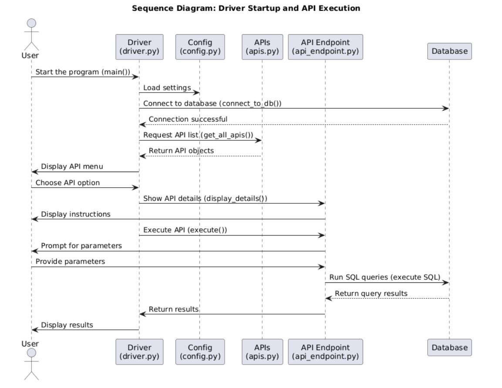
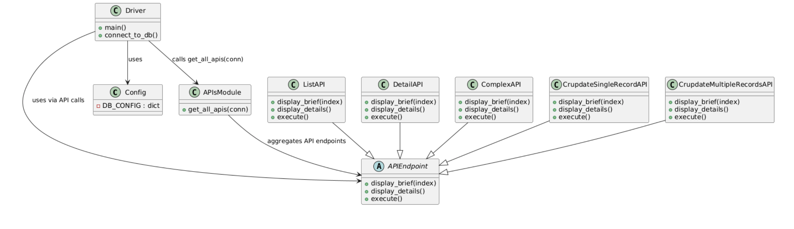

# LandscapingDB
LandscapeDB Project

## Overview
LandscapeDB is a command‑line Python application that interacts with a PostgreSQL database using psycopg2. The project is organized into separate modules so that each team member can develop their own API endpoints independently. Every API module (for client management, property management, service management, work record management, employee management, and financial management) implements a common interface defined by the APIEndpoint abstract class.

**Security & Efficiency:**  
Each API module leverages prepared statements for SQL queries. Prepared statements are compiled only once per session, which improves execution speed and reduces the risk of SQL injection.

**Dependencies:**  
Make sure you have installed the `psycopg2` package on your local machine for PostgreSQL connectivity.

## Setup Instructions

### 1. Database Creation and Population
Before running the application, you must create and populate the PostgreSQL database using the provided SQL script:
- **File:** `landscapingdb.txt`
- **How to Run:**  
  For example, you can execute the following command in your terminal: psql -U [your_username] -f landscapingdb.txt
  This script will drop (if necessary), create the database, and populate all the tables with the required schema and sample data.

### 2. Configuration File Setup
The project uses a configuration file to store database connection settings.
- **Template Provided:** `config.example.py`
- **Action Required:**  
Copy the template to create a local configuration file: cp config.example.py config.py
Then update the `DB_CONFIG` dictionary inside `config.py` with your actual database credentials (such as host, dbname, user, and password).

> **Note:** The `config.py` file is included in `.gitignore` to protect your sensitive information from being committed to version control.

## Database Connection
A global configuration (in `config.py`) provides the connection settings to the PostgreSQL database. The helper function in `driver.py` uses these settings to establish a connection.

## API Modules
- Each API module (e.g., `clientmanagement.py`, `propertymanagement.py`, etc.) contains one or more classes that inherit from `APIEndpoint`.
- **Implemented Methods:**
- **display_brief(index):**  
  Shows a one-line summary of the API.
- **display_details():**  
  Provides detailed usage information, including parameters and examples.
- **execute():**  
  Prompts for user input, executes parameterized SQL queries using prepared statements, manages transactions, and displays results.
- **Prepared Statements:**  
  Each API module prepares its own SQL statements upon instantiation. This means that each prepared statement is compiled only once per session, improving both performance and security.

## API Aggregation
  The `apis.py` file aggregates all the API endpoint objects. It imports individual API classes and provides a function `get_all_apis(conn)` that returns a dictionary of instantiated API objects grouped by domain. (Team members should add their modules here as they complete them.)

## Driver
The `driver.py` file is the main entry point:
- It connects to the database using settings from `config.py`.
- It retrieves the list of API objects from `apis.py`.
- It presents a CLI menu where the user selects an API by number.
- Once an API is selected, its detailed usage information is displayed and its `execute()` method is invoked.

## How to Add New APIs
1. **Create Your Module File:**  
 For example, if you're working on client management, create or update `clientmanagement.py`.
2. **Implement the API Endpoint:**  
  Define one or more classes that inherit from `APIEndpoint` (from `api_endpoint.py`) and implement the required methods.  
 **Important:** Prepare your SQL statements in the class constructor so that they are created only once per session.
3. **Update the APIs Aggregator:**  
  In `apis.py`, import your new class and add an instance of it (using the shared database connection) to the list returned by `get_all_apis()`.
4. **Test Your API:**  
  Run `python3 driver.py`, choose your API from the menu, and verify that it correctly prompts for input, executes its queries, and manages transactions and resources properly.

## Files Overview
- **config.example.py:**  
  Template for global database settings. Copy and rename it to `config.py` and update your credentials.
- **api_endpoint.py:**  
  Defines the abstract `APIEndpoint` class.
- **apis.py:**  
  Aggregates API objects (each team member’s module will be added here).
- **clientmanagement.py, propertymanagement.py, servicemanagement.py, workrecordmanagement.py, employeemanagement.py, financialmanagement.py:**  
  Each file contains one or more API classes for its domain.
- **driver.py:**  
  The main CLI driver that connects to the database, loads APIs, and interacts with the user.
- **landscapingdb.txt:**  
  SQL script to create, populate, and configure the PostgreSQL database.

## Running the Application
1. **Set Up the Database:**  
 Run the `landscapingdb.txt` script to create and populate your PostgreSQL database.
2. **Configure the Connection:**  
 Copy `config.example.py` to `config.py` and update it with your database credentials.
3. **Start the CLI:**  
  Run the driver: python3 driver.py

Follow the on-screen instructions to select and execute an API.

## Diagrams

### Sequence Diagram: Driver Startup and API Execution

### Class Diagram

